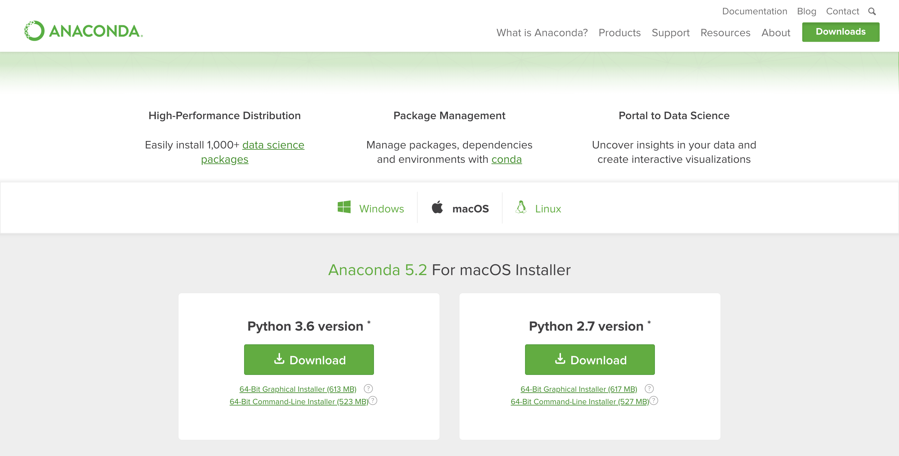
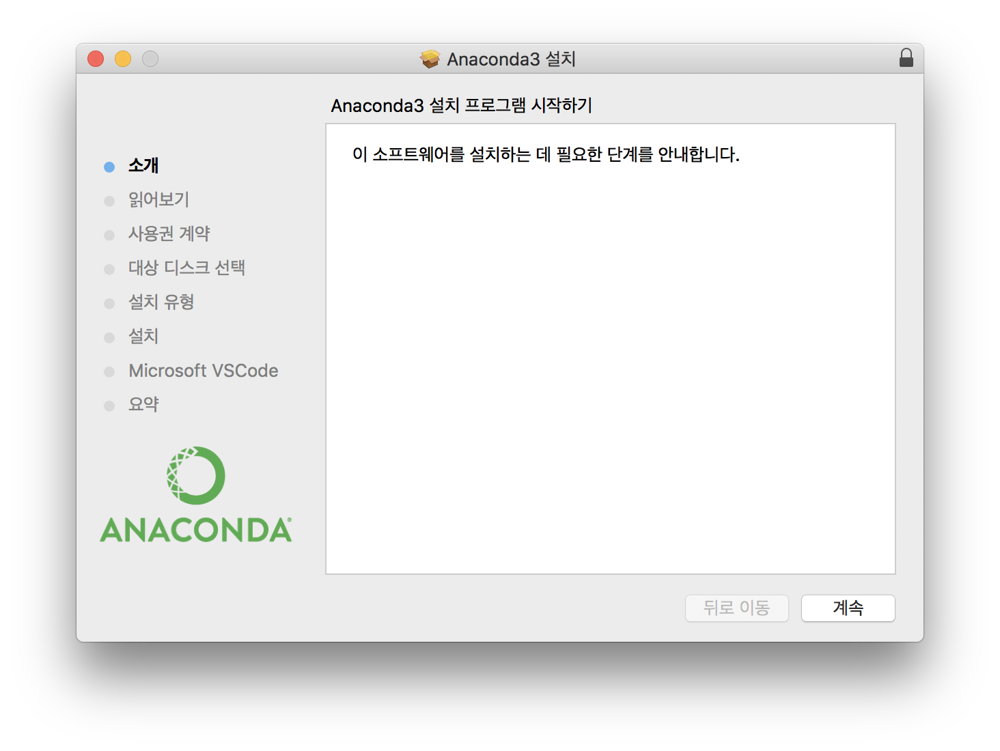
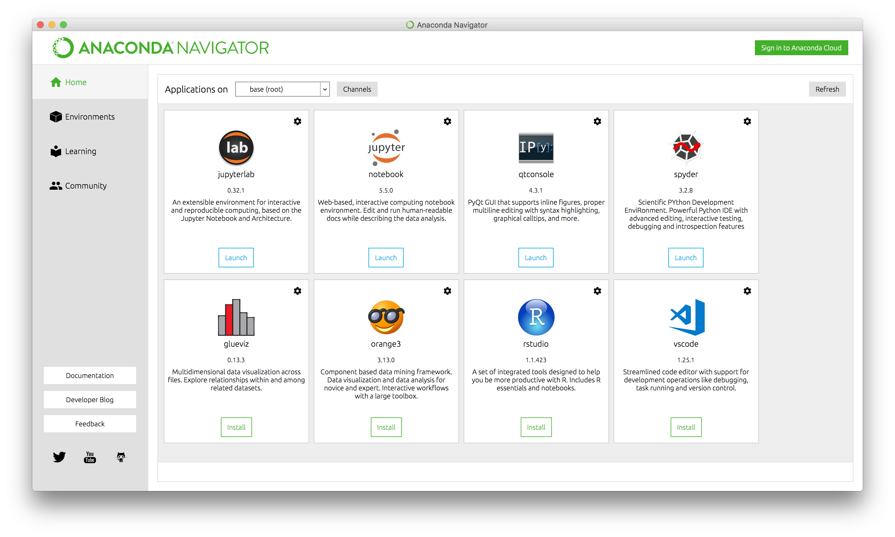
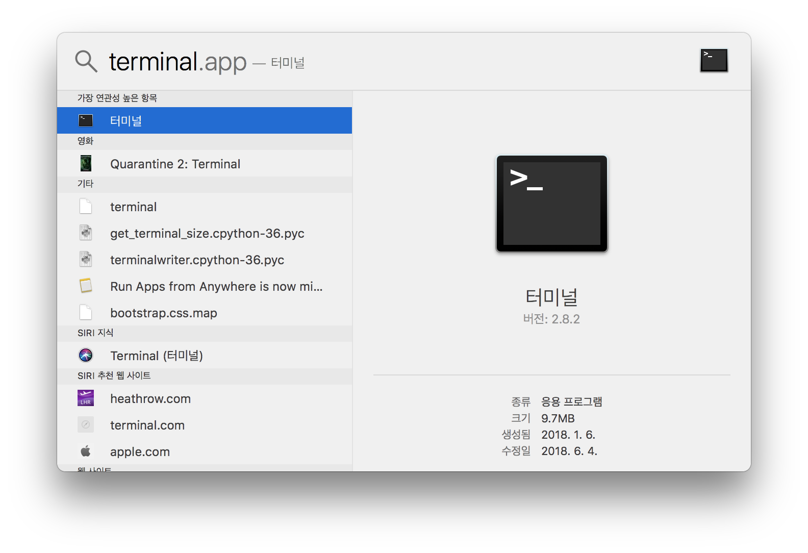
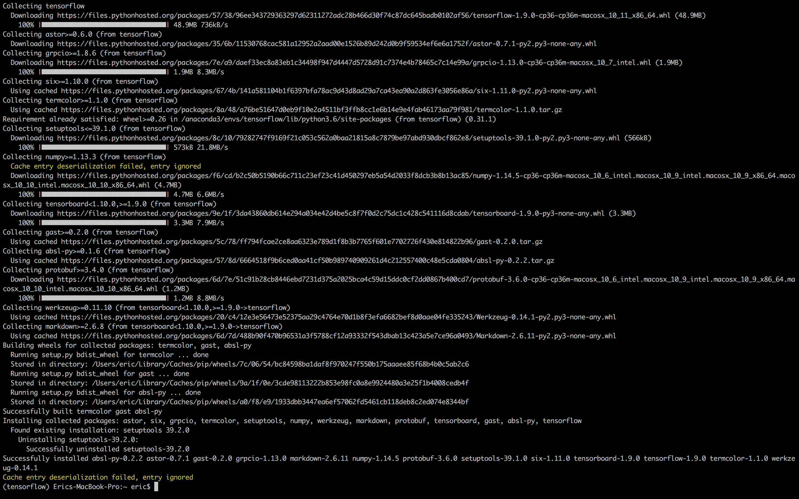

# Anaconda - MacOS 설치

Anaconda는 Python 기반의 개방형 데이터 과학 플랫폼입니다. Anaconda의 오픈 소스 버전은 Python 및 R의 고성능 배포이며 데이터 과학을 위해 가장 많이 사용되는 Python, R 및 Scala 패키지 중 100 개 이상을 포함합니다.

또한 아나콘다에 포함 된 유명한 패키지 인 의존성 및 환경 관리자 인 conda를 사용하여 쉽게 설치할 수있는 720 개가 넘는 패키지에 액세스 할 수 있습니다.

아나콘다를 설치하기 전이나 후에 별도로 Python을 설치할 필요가 없습니다.

## Anaconda 다운로드 및 설치

- [아나콘다 공식 다운로드 사이트](https://www.anaconda.com/download/) 접속
- [Python 3.6 version 다운로드](https://repo.anaconda.com/archive/Anaconda3-5.2.0-Windows-x86_64.exe)



- 설치 진행



## 설치 확인

- Anaconda Navigator 실행



## Tensorflow 설치

- Anaconda Prompt 실행



- pip 패키지 업그레이드
```
python -m pip install --upgrade pip
```

- Tensorflow를 위한 아나콘다 가상실행환경 만들기
```
conda crate -n tensorflow python=3.6
```

- Tensorflow 가상환경으로 들어가기
```
source activate tensorflow
```


- Tesnflow 설치
```
pip install tensorflow
```



- Tensorflow 설치 확인
```
python
import tensorflow as tf
hello = tf.constant('Hello, Tensorflow!')
sess = tf.Session()
print(sess.run(hello))
Output Hello, Tesorflow!
```


## Jupyter Notebook 설치 및 실행

- [Jupyter Notebook 설치 및 사용방법](../Jupyter/README.md)