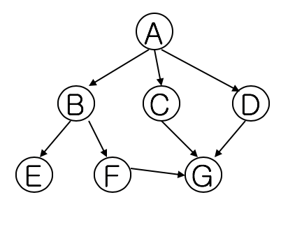

# Breadth First Search

너비 우선 탐색(Breadth-first search, BFS)은 맹목적 탐색방법의 하나로 시작 정점을 방문한 후 시작 정점에 인접한 모든 정점들을 우선 방문하는 방법이다. 더 이상 방문하지 않은 정점이 없을 때까지 방문하지 않은 모든 정점들에 대해서도 넓이 우선 검색을 적용한다. OPEN List 는 큐를 사용해야만 레벨 순서대로 접근이 가능하다.

## BFS 구현 실습

주어진 코드에 맞춰 코드를 작성하고 실행해보세요.

- (1) 가장 왼쪽에 있는 State를 X에 할당
    - hint: pop()
- (2) X와 GOAL이 같을 때를 표현
- (3) children에 X의 자식노드들을 할당
    - graph의 구조를 참고하세요.
- (4) closed에 X를 추가
    - hint: extend()
- (5) open과 closed 리스트를 확인하여 중복된 child를 제거
	- for문과 if문을 사용
- (6) 남은 children을 open 리스트 오른쪽에 추가
    - hint: extend()

## Code

- [Breadth_First_Search.ipynb](./Breadth_First_Search.ipynb)
- [Breadth_First_Search.html](./Breadth_First_Search.html)

## Solution

- [Solution](./Solutions/Breadth_First_Search_Solution.ipynb)