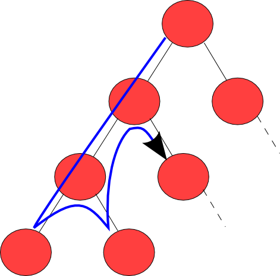

# Depth First Search

깊이 우선 탐색(depth-first search: DFS)은 맹목적 탐색방법의 하나로 탐색트리의 최근에 첨가된 노드를 선택하고, 이 노드에 적용 가능한 동작자 중 하나를 적용하여 트리에 다음 수준(level)의 한 개의 자식노드를 첨가하며, 첨가된 자식 노드가 목표노드일 때까지 앞의 자식 노드의 첨가 과정을 반복해 가는 방식이다.

## DFS 구현 실습

주어진 코드에 맞춰 코드를 작성하고 실행해보세요.

- (1) 가장 왼쪽에 있는 State를 X에 할당
    - hint: pop()
- (2) X와 GOAL이 같을 때를 표현
- (3) children에 X의 자식노드들을 할당
    - graph의 구조를 참고하세요.
- (4) closed에 X를 추가
    - hint: extend()
- (5) open과 closed 리스트를 확인하여 중복된 child를 제거
	- for문과 if문을 사용
- (6) 남은 children을 open 리스트 왼쪽에 추가
    - hint: + 연산자

## Code

- [Depth_First_Search.ipynb](./Depth_First_Search.ipynb)
- [Depth_First_Search.html](./Depth_First_Search.html)

## Solution

- [Solution](./Solutions/Depth_First_Search_Solution.ipynb)